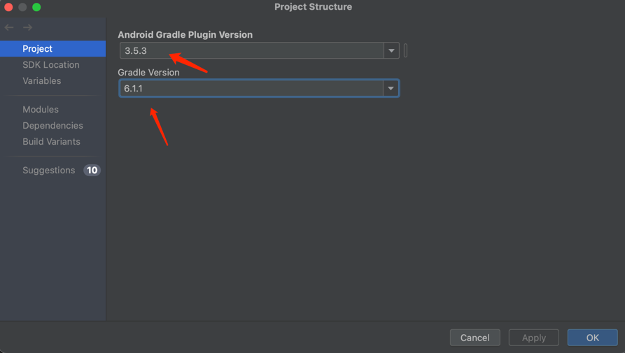

# FATJS

### 介绍
FATJS 基于安卓无障碍的自动化框架，集成找色

### 加入圈子
加自动化开发交流群
➕v：vxid_7pd10zl5bzqs21
不定期分享一些自动化开发的干货，群里很多大佬也是做这个的，
有问题可以在群里提问，群里气氛也是非常活跃
  

### 项目搭建
#### gradle:

#### jdk选11或者8

#### 需要注意的点
1. 不要用市面上常见的自动化工具或者软件，都烂大街了，必定会被检测
2. 养号很重要，先保证账号和手机环境没问题，再上脚本。比如某音先刷刷视频啥的
3. 不能一直大量重复做非常单一的动作，操作尽量像个真人
4. 每个点击与滑动的坐标尽量加上随机偏移值
5. 不要打开开发者模式和adb调试，正常手机都不会开这个的。无障碍是Google官方功能，一般是没问题的
6. 手机不root，不解bl锁
