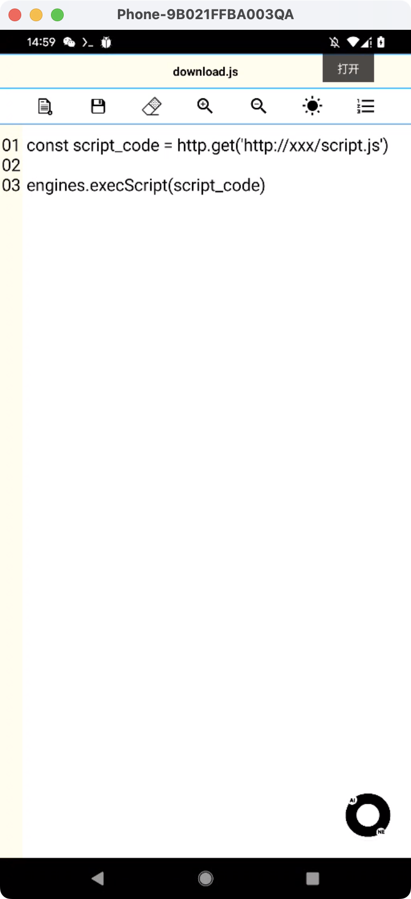

# FATJS

#### 介绍
>FATJS 基于安卓无障碍的自动化框架，集成找色，引入V8引擎，api类似autojs

#### B站FATJS教程合集
>https://space.bilibili.com/1456611110/

#### FATJS文档
>http://fatjs.fun/
or
>http://43.143.157.144/

#### 加入圈子
> - 加FATJS自动化交流群 ➕v：FATJS_Lin 不定期分享一些FATJS框架开发的干货
> - 群里有很多大佬，有问题可以在群里提问，群里气氛也是非常活跃
> - 技术总是不断过时，加入圈子，才能无限接近大佬，获取最新技术和经验

#### 需要注意的点
>1. 不要用市面上常见的自动化工具或者软件，必定会被检测
>2. 养号很重要，先保证账号和手机环境没问题，再上脚本
>3. 不能一直大量重复做非常单一的动作，操作尽量像个真人
>4. 每个点击与滑动的坐标尽量加上随机偏移值
>5. 不要打开开发者模式和adb调试，正常手机都不会开这个的。无障碍是Google官方功能，一般是没问题的
>6. 手机不root，不解bl锁
>7. （仅用于学习交流，切勿用于非法途径！）

#### 🗺 预览图

|  |  |  |
| ------------------------------------------------------------ | ------------------------------------------------------------ | ------------------------------------------------------------ |
|  |  |  |

#### Api示例

```js
move('打开') //移动悬浮窗
print('返回桌面') //打印日志
home()
print('点击设置')
text('设置').findOne().click()
sleep(2000) //等待2s
back() //返回
```

#### 知识星球

| FATJS & 安卓逆向知识星球，<br/>会总结个人踩坑经验、知识点总结以及工具分享。<br/>有问题也可以在星球向我提问 | 如果您觉得我的开源库帮你节省了大量的开发时间，<br/>请扫描下方的二维码随意打赏。<br/>您的支持将鼓励我继续创作！ |
|----------------------------------------------------------------|--------------------------------------------------------------|
|     |   |